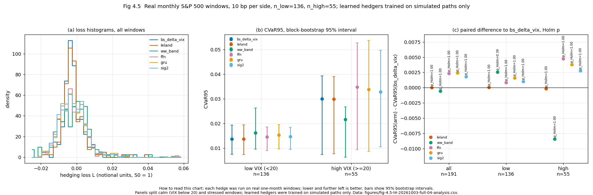
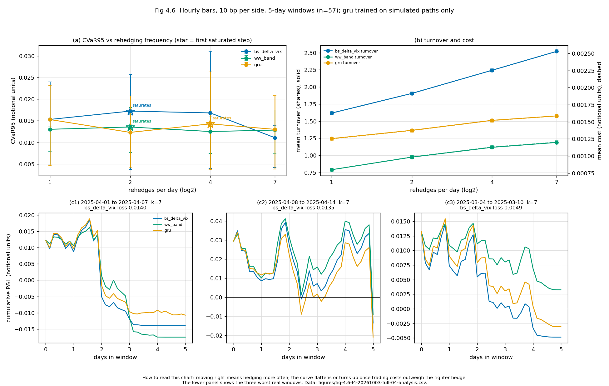

# Rough-volatility deep hedging

This project develops and evaluates deep hedging policies under a calibrated rough-Bergomi market model.  The release includes three executable notebooks, production implementations, compact provenance, and real-window replay artifacts. Raw market inputs and model checkpoints are not redistributed.

## Index

| Path | Contents |
| --- | --- |
| `notebooks/01_mathematical_foundations.ipynb` | Rough-volatility, pricing, and CVaR foundations. |
| `notebooks/02_synthetic_playground.ipynb` | Simulation-based hedging experiments. |
| `notebooks/03_real_data.ipynb` | Market-data calibration and real-window evaluation. |
| `rough_hedge/` | Reusable simulation, risk, hedging, and training code. |
| `scripts/exp_nb03_hedging.py` | Immutable training, replay, and visualization CLI. |
| `results/nb03/runs/l4-20261003-full-04/` | Compact L4 training and replay provenance. |

## Reproduction

Use Python 3.12 with NumPy, SciPy, pandas, matplotlib, and PyTorch. Obtain market inputs independently with `python scripts/fetch_data.py`; the included manifest records their expected hashes. Run the immutable replay pipeline with:

```bash
python scripts/exp_nb03_hedging.py train --run-id RUN_ID --workers 4
python scripts/exp_nb03_hedging.py replay --run-id RUN_ID
python scripts/exp_nb03_hedging.py figures --run-id RUN_ID
```

## Real-market replay visualizations

<table><tr>
<td width="50%"><br><sub><b>Figure 4.5.</b> Daily real-window losses, regime CVaR95, and paired differences. Data: <code>fig-4.5-l4-20261003-full-04-analysis.csv</code>.</sub></td>
<td width="50%"><br><sub><b>Figure 4.6.</b> Intraday CVaR-frequency trade-off, turnover/cost, and failure paths. Data: <code>fig-4.6-l4-20261003-full-04-analysis.csv</code>.</sub></td>
</tr></table>

The daily replay spans 191 non-overlapping S&P 500/VIX windows; the intraday replay spans 57 complete five-day hourly windows. Learned policies are trained on simulated paths only. Both recorded prefix-information leakage probes pass exactly.

## References

1. Bayer, C., Friz, P., and Gatheral, J. *Pricing under rough volatility*. Quantitative Finance, 2016.
2. Buehler, H., Gonon, L., Teichmann, J., and Wood, B. *Deep Hedging*. Quantitative Finance, 2019.
3. Rockafellar, R. T., and Uryasev, S. *Optimization of Conditional Value-at-Risk*. Journal of Risk, 2000.
