# Rough-volatility deep hedging

This project develops and evaluates deep hedging policies under a calibrated rough-Bergomi market model. It contains executable result notebooks, reusable simulation and hedging code, compact cloud-run provenance, and the CSV tables supporting every displayed result. Raw market downloads, model checkpoints, and workflow artifacts are intentionally excluded.

## Start here

| Path | Purpose |
| --- | --- |
| `notebooks/01_mathematical_foundations.ipynb` | Rough-volatility, pricing, and CVaR foundations. |
| `notebooks/02_synthetic_playground.ipynb` | Completed L4 synthetic recipe study; one figure per cell. |
| `notebooks/03_real_data.ipynb` | Simulated-training evidence followed by historical S&P 500 replay. |
| `notebooks/README.md` | Theory, reading order, and evidence boundary. |
| `rough_hedge/` | Reusable simulation, risk, hedging, and training implementation. |
| `scripts/t4_recipes.py` | Recipe-study trainer (small profile). |
| `scripts/t4_recipes_large.py` | Recipe-study trainer as run for the large profile. |
| `scripts/exp_nb03_hedging.py` | Immutable training and replay pipeline. |
| `results/` | Compact L4 training and replay provenance. |

## Results at a glance

In the synthetic L4 study, 15 recipe × architecture cells are evaluated per profile under common accounting. The large profile has lower mean CVaR95 than the small profile for all 15 paired cells; the best recorded large-profile unit has CVaR95 0.05742 versus 0.06195 for Black--Scholes delta on the common simulated evaluation. Notebook 03 then separates this simulated evidence from the historical S&P 500 replay, including daily and intraday rehedging trade-offs.

These are conditional experimental and historical-replay results, not investment advice or a claim of future trading performance.

## Visual results

Every panel is generated from the CSV beside it in `figures/`; gallery copies in `figures/readme/` are padded per row so each pair renders at the same size (`scripts/make_readme_gallery.py`).

### Mathematical foundations (Notebook 01)

<table><tr>
<td width="50%" valign="top">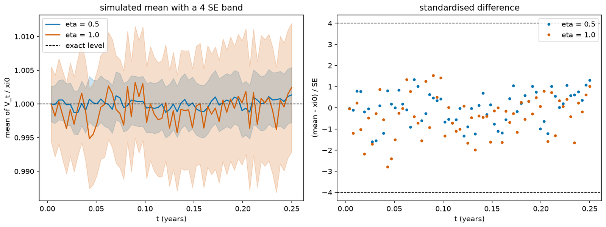<br><sub><b>Figure 1.0.</b> Simulated variance mean with a ±4 standard-error band. Data: <code>figures/fig-1.0.csv</code>.</sub></td>
<td width="50%" valign="top">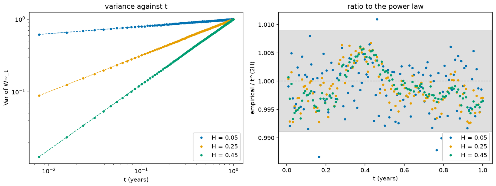<br><sub><b>Figure 1.7.</b> Volterra variance power-law check. Data: <code>figures/fig-1.7.csv</code>.</sub></td>
</tr></table>

<table><tr>
<td width="50%" valign="top">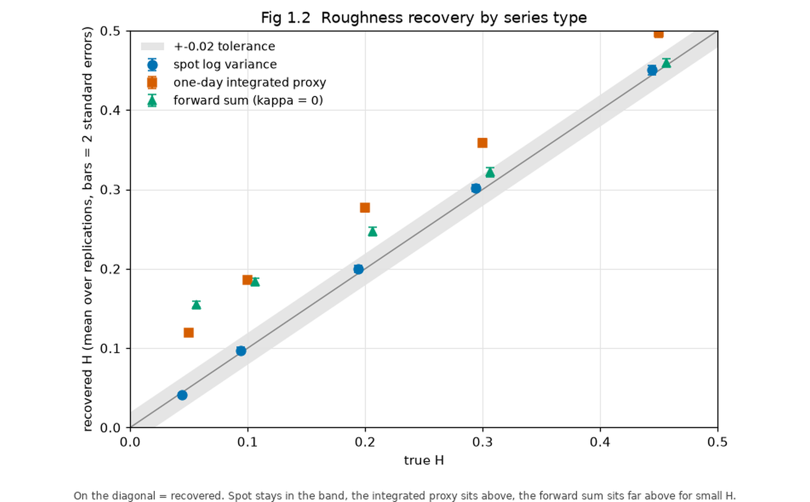<br><sub><b>Figure 1.2.</b> Roughness recovery by series type: spot variance stays on the diagonal, smoothed proxies overstate H. Data: <code>figures/fig-1.2.csv</code>.</sub></td>
<td width="50%" valign="top">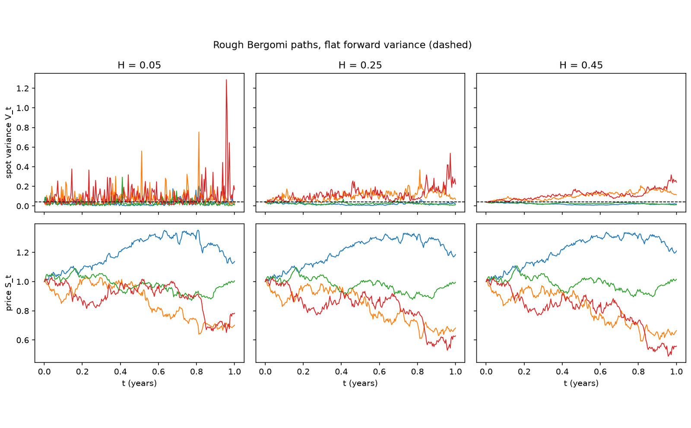<br><sub><b>Figure 1.6.</b> Rough-Bergomi variance and spot sample paths. Data: <code>figures/fig-1.6.csv</code>.</sub></td>
</tr></table>

### Synthetic L4 recipe study (Notebook 02)

<table><tr>
<td width="50%" valign="top">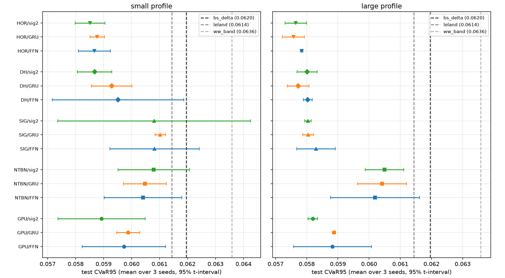<br><sub><b>Figure 5.1.</b> CVaR95 leaderboard: every large-profile cell beats all three classical hedges. Data: <code>figures/fig-5.1.csv</code>.</sub></td>
<td width="50%" valign="top">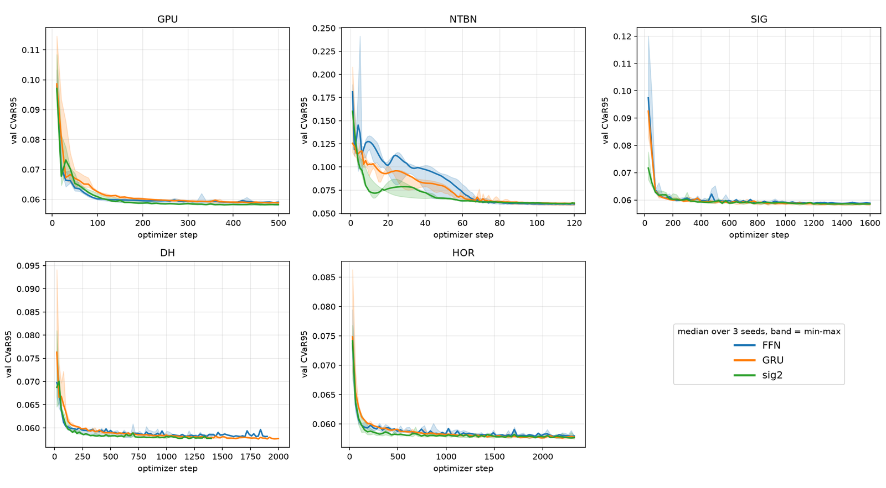<br><sub><b>Figure 5.3.</b> Validation CVaR95 learning curves per recipe. Data: <code>figures/fig-5.3.csv</code>.</sub></td>
</tr></table>

<table><tr>
<td width="50%" valign="top">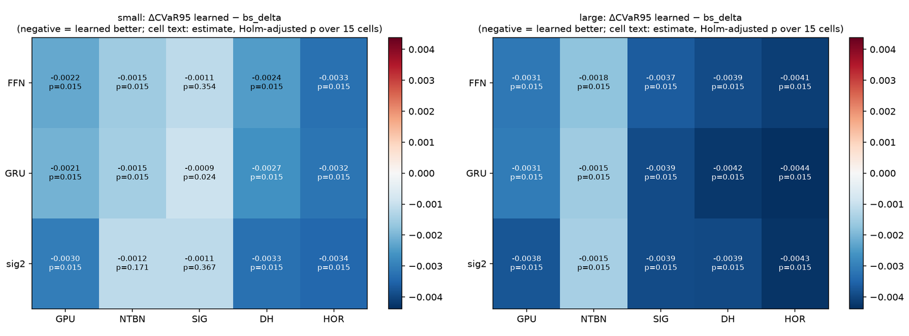<br><sub><b>Figure 5.2.</b> Paired CVaR95 gaps to Black–Scholes delta with Holm-adjusted p-values. Data: <code>figures/fig-5.2.csv</code>.</sub></td>
<td width="50%" valign="top">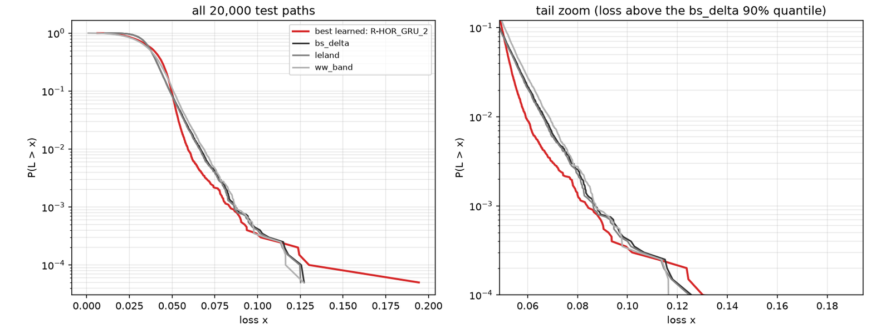<br><sub><b>Figure 5.15.</b> Loss exceedance: better tail up to the 99.9% level, worse single worst path. Data: <code>figures/fig-5.15.csv</code>.</sub></td>
</tr></table>

<table><tr>
<td width="50%" valign="top">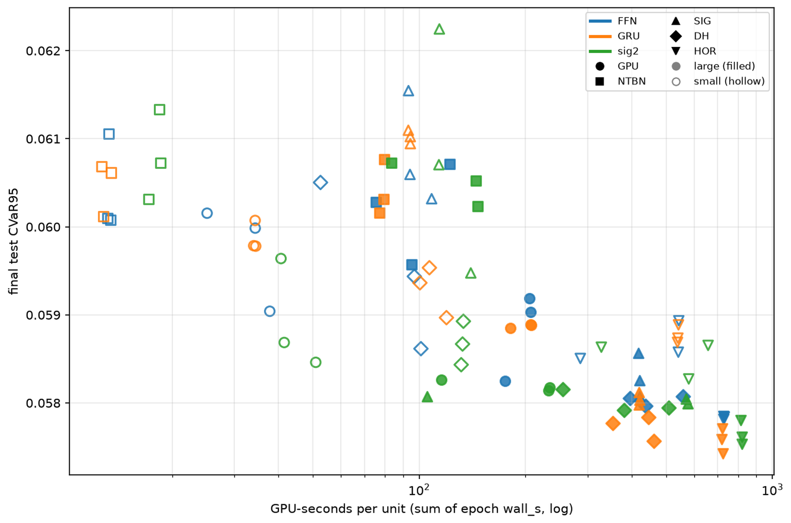<br><sub><b>Figure 5.4.</b> Compute–risk frontier: GPU-seconds against final CVaR95. Data: <code>figures/fig-5.4.csv</code>.</sub></td>
<td width="50%" valign="top">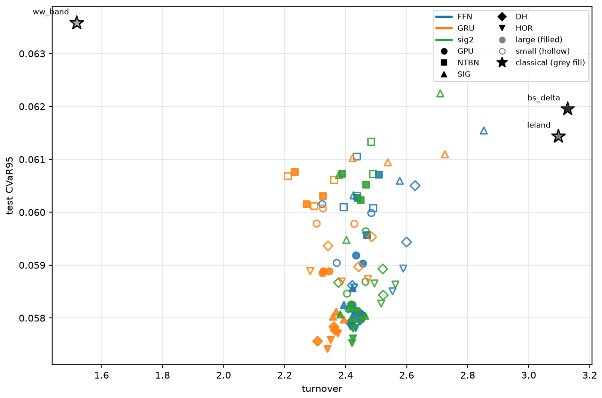<br><sub><b>Figure 5.14.</b> Tail risk against turnover, with the classical hedges as stars. Data: <code>figures/fig-5.14.csv</code>.</sub></td>
</tr></table>

<table><tr>
<td width="50%" valign="top">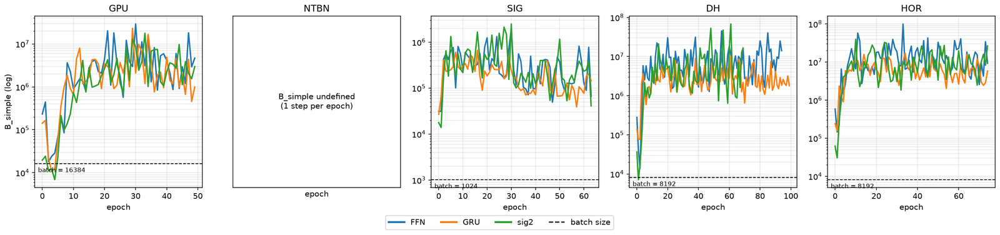<br><sub><b>Figure 5.5.</b> Gradient noise scale 100–900× the batch size: every recipe is batch-starved. Data: <code>figures/fig-5.5.csv</code>.</sub></td>
<td width="50%" valign="top">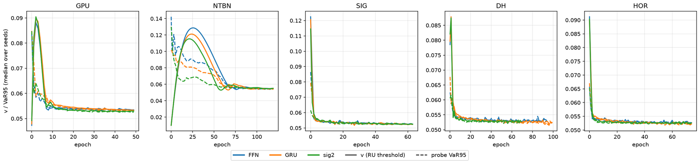<br><sub><b>Figure 5.6.</b> The learned CVaR threshold converges to the empirical VaR95. Data: <code>figures/fig-5.6.csv</code>.</sub></td>
</tr></table>

<table><tr>
<td width="50%" valign="top">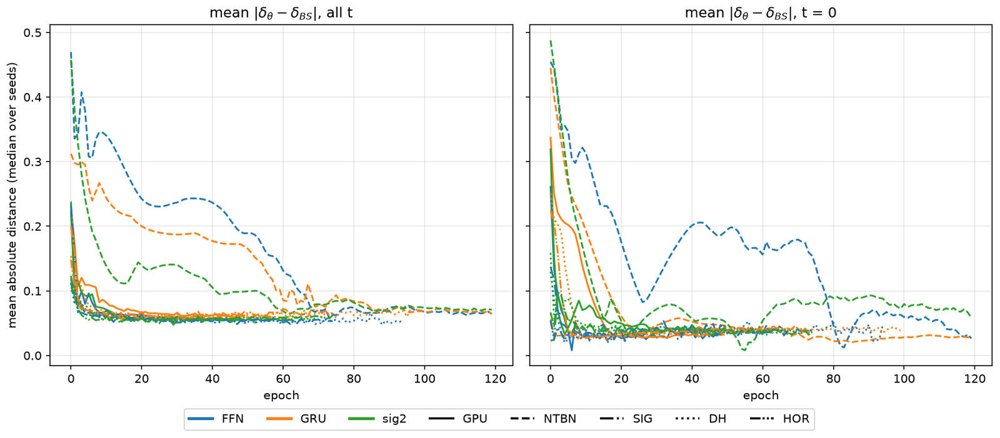<br><sub><b>Figure 5.7.</b> Learned hedge ratios settle about 0.06 away from Black–Scholes delta. Data: <code>figures/fig-5.7.csv</code>.</sub></td>
<td width="50%" valign="top">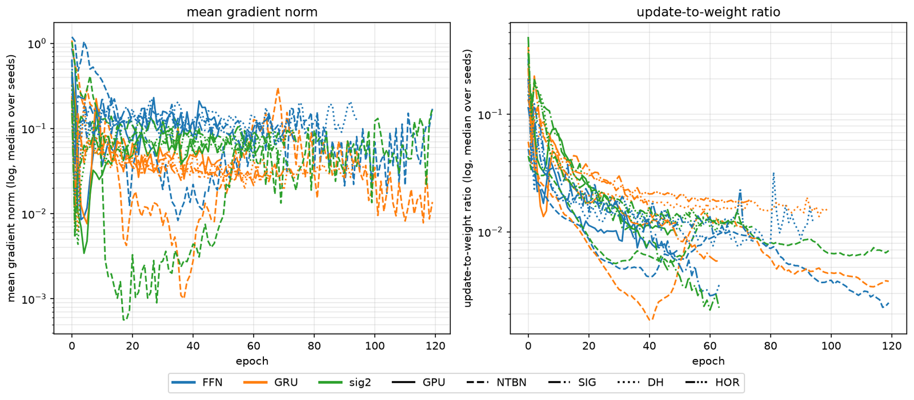<br><sub><b>Figure 5.16.</b> Gradient norm and update-to-weight ratio during training. Data: <code>figures/fig-5.16.csv</code>.</sub></td>
</tr></table>

<table><tr>
<td width="50%" valign="top">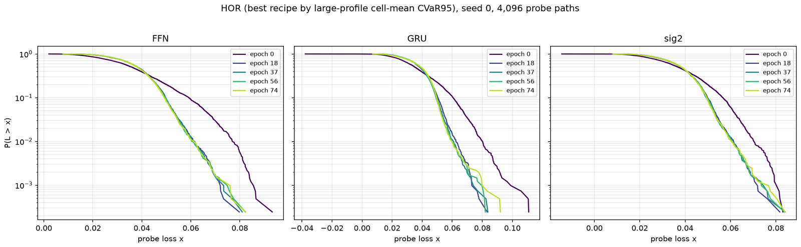<br><sub><b>Figure 5.8.</b> Probe-loss survival curves at five training snapshots. Data: <code>figures/fig-5.8.csv</code>.</sub></td>
<td width="50%" valign="top">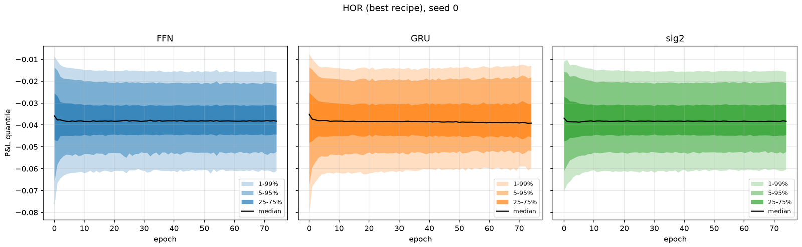<br><sub><b>Figure 5.9.</b> P&L quantile fan during training. Data: <code>figures/fig-5.9.csv</code>.</sub></td>
</tr></table>

<table><tr>
<td width="50%" valign="top">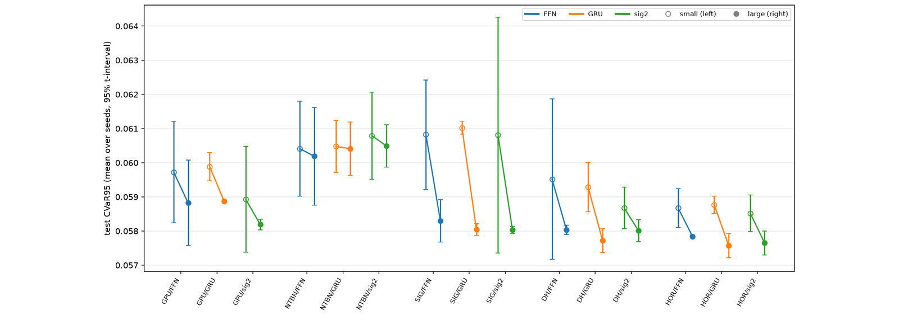<br><sub><b>Figure 5.10.</b> Small against large training profile: all 15 cells improve. Data: <code>figures/fig-5.10.csv</code>.</sub></td>
<td width="50%" valign="top">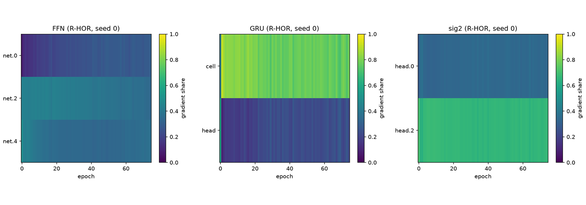<br><sub><b>Figure 5.13.</b> Share of the gradient carried by each layer. Data: <code>figures/fig-5.13.csv</code>.</sub></td>
</tr></table>

<table><tr>
<td width="50%" valign="top">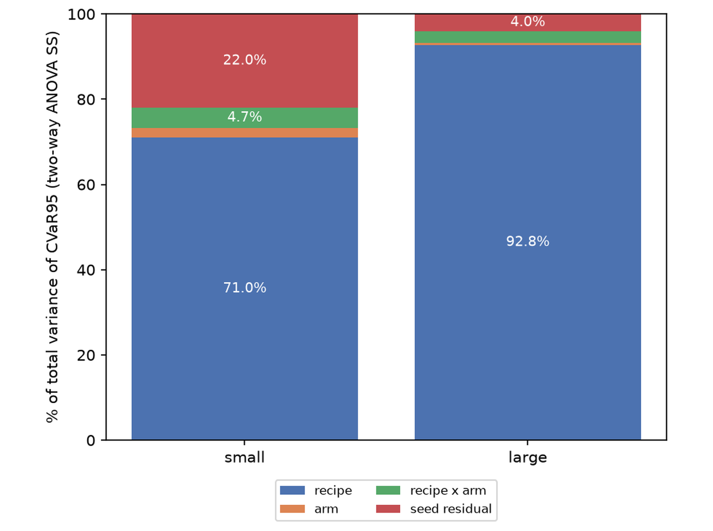<br><sub><b>Figure 5.11.</b> Variance attribution: recipe 92.8%, seed 4.0% in the large profile. Data: <code>figures/fig-5.11.csv</code>.</sub></td>
<td width="50%" valign="top">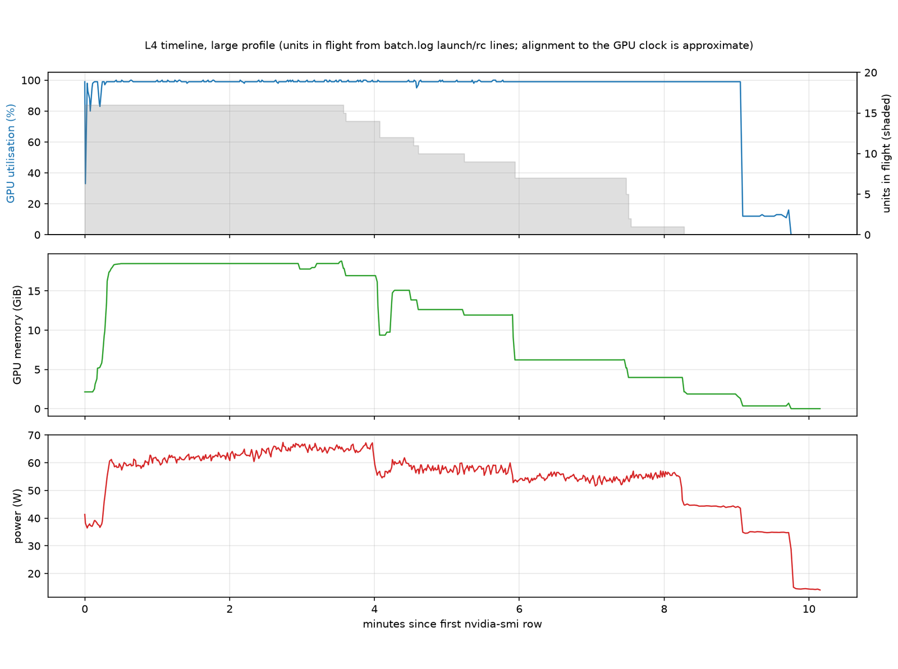<br><sub><b>Figure 5.12.</b> L4 utilisation, memory and power during the large-profile run. Data: <code>figures/fig-5.12.csv</code>.</sub></td>
</tr></table>

### Historical S&P 500 replay (Notebook 03)

<table><tr>
<td width="50%" valign="top">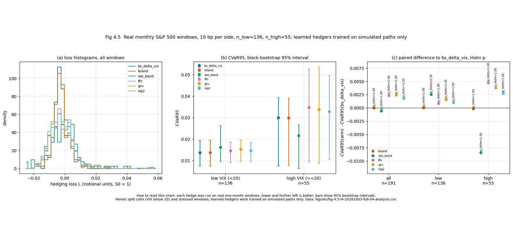<br><sub><b>Figure 4.5.</b> Daily replay on 191 real monthly windows: learned hedgers trained on simulations do not beat delta. Data: <code>figures/fig-4.5-l4-20261003-full-04-analysis.csv</code>.</sub></td>
<td width="50%" valign="top">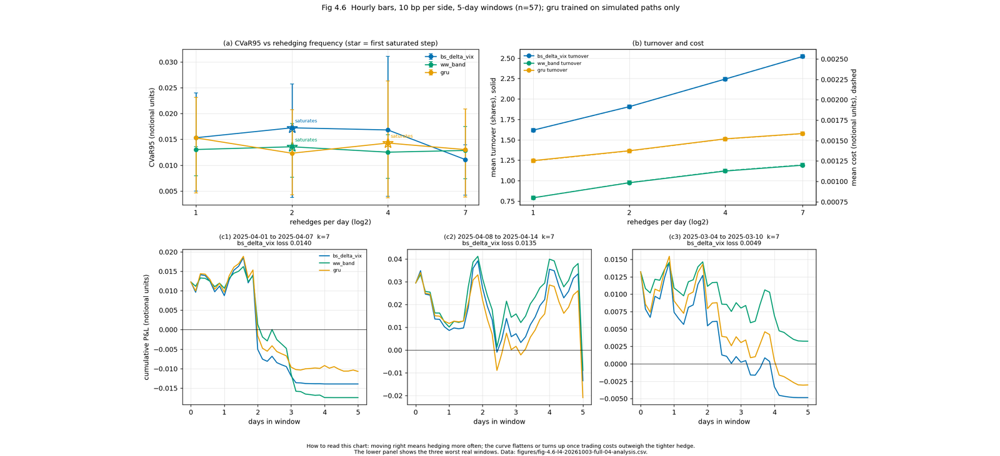<br><sub><b>Figure 4.6.</b> Intraday rehedging on 57 real five-day windows: frequency, turnover and the worst windows. Data: <code>figures/fig-4.6-l4-20261003-full-04-analysis.csv</code>.</sub></td>
</tr></table>

## Reproduction

Use Python 3.12 with NumPy, SciPy, pandas, matplotlib, and PyTorch. Obtain market inputs independently with:

```bash
python scripts/fetch_data.py
```

Run the immutable replay pipeline with:

```bash
python scripts/exp_nb03_hedging.py train --run-id RUN_ID --workers 4
python scripts/exp_nb03_hedging.py replay --run-id RUN_ID
python scripts/exp_nb03_hedging.py figures --run-id RUN_ID
```

The compact evidence already used by the notebooks is under `results/nb02/t4_stats.json` and `results/nb03/runs/l4-20261003-full-04/`.

## References

1. Bayer, C., Friz, P., and Gatheral, J. *Pricing under rough volatility*. Quantitative Finance, 2016.
2. Buehler, H., Gonon, L., Teichmann, J., and Wood, B. *Deep Hedging*. Quantitative Finance, 2019.
3. Rockafellar, R. T., and Uryasev, S. *Optimization of Conditional Value-at-Risk*. Journal of Risk, 2000.
