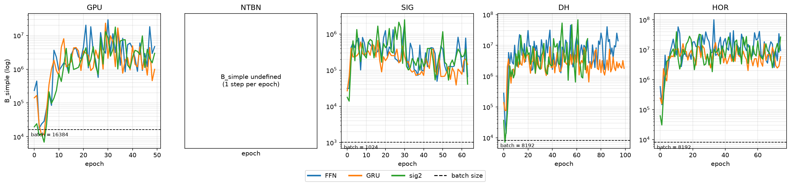
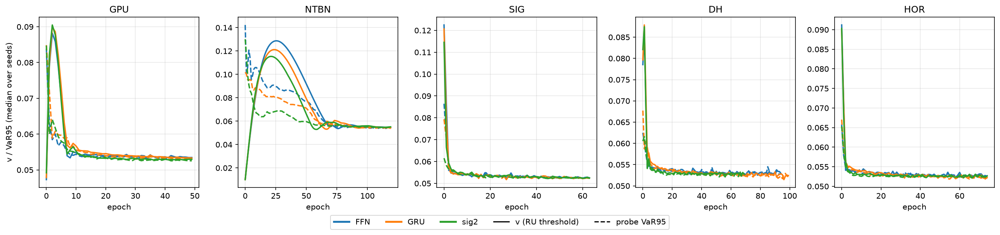
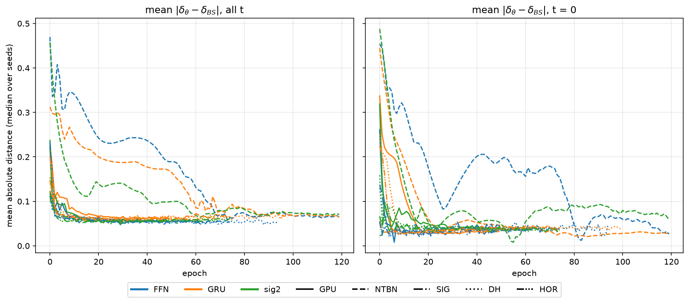
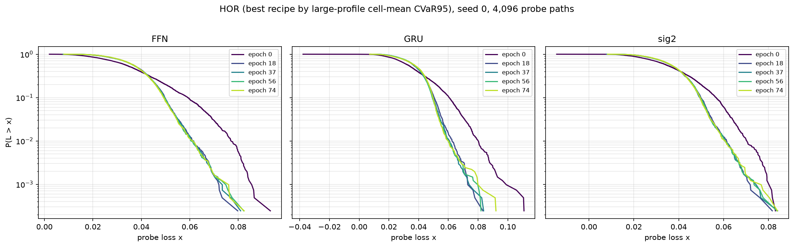
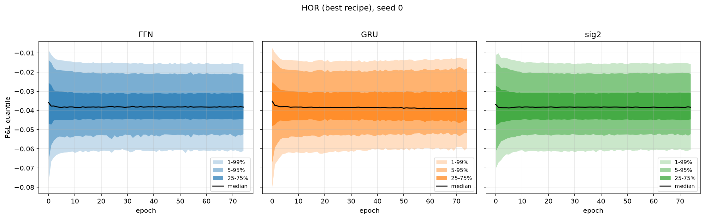
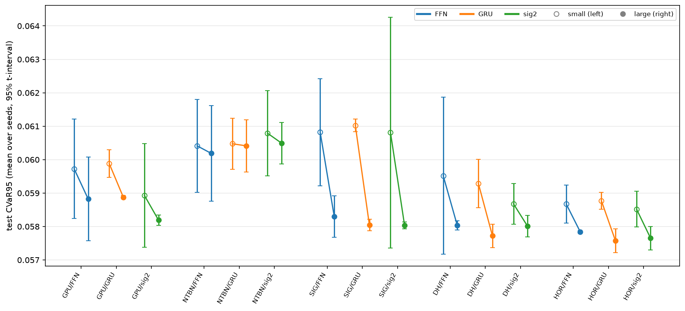
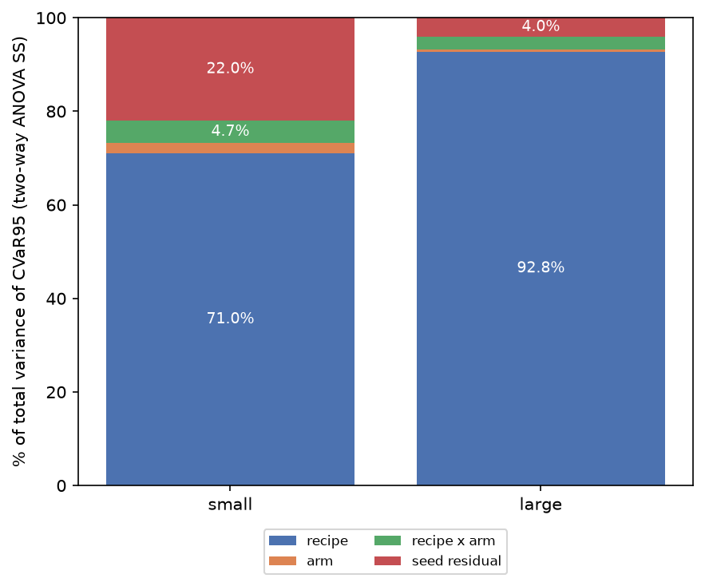
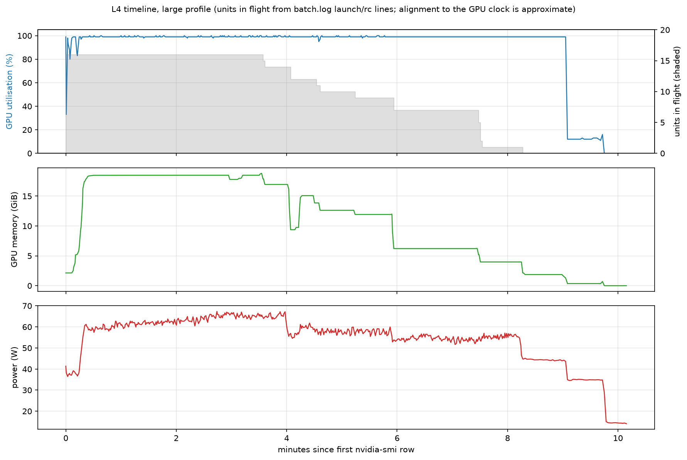

# Notebooks and training diagnostics

## Notebook index

1. [Mathematical foundations](01_mathematical_foundations.ipynb) develops rough-volatility simulation, estimation, pricing, and risk conventions.
2. [Synthetic playground](02_synthetic_playground.ipynb) studies learned hedges in simulated markets.
3. [Real data](03_real_data.ipynb) calibrates inputs and replays policies on held-out market windows.

The main README presents outcome-level figures. This page retains the detailed diagnostic panels used to interpret the synthetic training study. Every figure below has its CSV data in `../figures/`.

## Optimization diagnostics

<table><tr>
<td width="25%"> <b>Figure 5.5.</b> Gradient-noise proxy versus batch size; <code>fig-5.5.csv</code>.</td>
<td width="25%"> <b>Figure 5.6.</b> CVaR threshold against VaR95; <code>fig-5.6.csv</code>.</td>
<td width="25%"> <b>Figure 5.7.</b> Learned-policy distance from delta; <code>fig-5.7.csv</code>.</td>
<td width="25%"> <b>Figure 5.8.</b> Loss-survival evolution; <code>fig-5.8.csv</code>.</td>
</tr></table>

## Distribution and infrastructure diagnostics

<table><tr>
<td width="25%"> <b>Figure 5.9.</b> P&amp;L quantiles through training; <code>fig-5.9.csv</code>.</td>
<td width="25%"> <b>Figure 5.10.</b> Small/large profile comparison; <code>fig-5.10.csv</code>.</td>
<td width="25%"> <b>Figure 5.11.</b> Recipe/model/seed variance shares; <code>fig-5.11.csv</code>.</td>
<td width="25%"> <b>Figure 5.12.</b> L4 utilization timeline; <code>fig-5.12.csv</code>.</td>
</tr></table>
